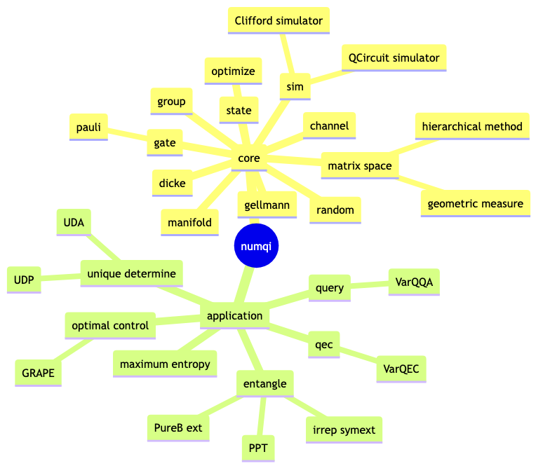

# NumQI

**WARNING**: the package is still under development, the documentation page is for preview only.

**WARNING**: no backward compatiblity until version `1.0.0` (TODO roadmap). Right now, feel free to ask questions on GitHub issue page (TODO to be public).

`numqi` (pronouce: num(-py)-q-i) a numpy-based quantum information package.



Core modules

1. `numqi.sim`: numpy based quantum simulator [wiki/quantum-simulator](https://en.wikipedia.org/wiki/Quantum_simulator), support gradient back-propagation and variational quantum circuits, Clifford circuit simulator
2. `numqi.dicke`: Dicke basis, bosonic states
3. `numqi.random`: sample random quantum states, matrices, channels, etc.
4. `numqi.state`: various quantum states, like Werner state, Bell state, etc. and their properties like entanglement measure, etc.
5. `numqi.gate`: various quantum gate [wiki/quantum-logic-gate](https://en.wikipedia.org/wiki/Quantum_logic_gate), like Pauli gate (various representation), Clifford gate, etc.
6. `numqi.gellmann`: convert matrix into gellmann basis and reversally [wiki/gellmann](https://en.wikipedia.org/wiki/Gell-Mann_matrices) [wiki/generalized-gellmann](https://en.wikipedia.org/wiki/Generalizations_of_Pauli_matrices)
7. `numqi.channel`: utilities related to quantum channel, like conversion between different representations of a quantum channel (Kraus operator, super-operator, Choi state, etc.) [wiki/quantum-channel](https://en.wikipedia.org/wiki/Quantum_channel)
8. `numqi.manifold`: trivialzation of various smooth manifolds and quantum objects
    * smooth manifold: sphere, positive semi-definite matrix, special orthogonal / unitary group, Stiefel manifold etc.
    * quantum object: denotes quantum state, quantum gate, Hamiltonian, quantum channel etc.
9. `numqi.group`: some basic utility for group theory [wiki/group](https://en.wikipedia.org/wiki/Group_(mathematics)), like irreducible representation, symmetric group, Symplectic group over finite field `Sp(2n, F2)`, etc.
10. `numqi.optimize`: wrapper of `scipy.optimize` and `SGD/Adam` optimizers for manifold optimization
11. `numqi.matrix_space`: Numerical range, linear space of matrices, geometric measure, hierarchical method, etc.
     * Quantifying Subspace Entanglement with Geometric Measures [arxiv-link](https://arxiv.org/abs/2311.10353)
12. `numqi.utils`: some utility functions, like, calculate fidelity, purity, entropy etc.

Application modules

1. `numqi.entangle`: detect entanglement [wiki/quantum-entanglement](https://en.wikipedia.org/wiki/Quantum_entanglement)
    * PPT (positive partial transpose)
    * convex hull approximation
    * Pure Bosonic extension [arxiv-link](https://arxiv.org/abs/2209.10934)
    * irreducible representation of symmetric extension [doi-link](https://doi.org/10.3390/e25101425)
    * unextendible product state, bound extangled state, etc.
2. `numqi.maximum_entropy`: relation between Hamiltonian, groud state, and marginal problem
    * Maximum entropy methods for quantum state compatibility problems [arxiv-link](https://arxiv.org/abs/2207.11645)
3. `numqi.qec`: quantum error correction code (QECC) [wiki](https://en.wikipedia.org/wiki/Quantum_error_correction)
    * Variational learning for quantum error-correcting codes [doi-link](https://doi.org/10.22331/q-2022-10-06-828)
    * circuits to encode some well-known QECC, like `((5,2,3))`, `((8,8,3))`
4. `numqi.unique_determine`: unique determinedness in quantum state tomography
    * Variational Approach to Unique Determinedness in Pure-state Tomography [arxiv-link](https://arxiv.org/abs/2305.10811)
5. `numqi.query`: quantum query
    * Variational learning algorithms for quantum query complexity [arxiv-link](https://arxiv.org/abs/2205.07449)
6. `numqi.optimal_control`: optimal control for quantum system, e.g. finding the optimal control pulse to implement a quantum gate
    * Gradient ascent pulse engineering algorithm (GRAPE) (gradient ascent pulse engineering)

Generally, the application modules are implemented based on the core modules. For example, the `numqi.entangle` module use quite a lots of the module `numqi.group` and `numqi.optimize`. For those who are more interested in quantum information problems, you may directly dive into these specific modules. For those who are more interested in the underlying algorithms or math concepts, you may start from the core modules.

*PS*: Stay relaxing if none of these terminologies make sense, I will (try to) explain these words in the following pages.

## quicksta

## Quickstart

```bash
pip install numqi
# TODO upload to pypi.org
```

Detect whether Bell state [wiki](https://en.wikipedia.org/wiki/Bell_state) is entangled or not using positive partial transpose (PPT) criteria.

```python
import numqi
bell_state = numqi.state.Werner(d=2, alpha=1)
print(bell_state)
# [[ 0.   0.   0.   0. ]
#  [ 0.   0.5 -0.5  0. ]
#  [ 0.  -0.5  0.5  0. ]
#  [ 0.   0.   0.   0. ]]
print(numqi.entangle.is_ppt(bell_state, (2,2))) #True if seperable, False if entangled
# False
```

Let's try a "non-trival" quantum circuit (Five-qubit error correcting code)

```python
import numpy as np
import numqi
circ = numqi.sim.Circuit()
for x in range(4):
    circ.H(x)
circ.cz(3, 4)
circ.cy(2, 3)
circ.cz(2, 4)
circ.cx(1, 2)
circ.cz(1, 3)
circ.cx(1, 4)
circ.cy(0, 2)
circ.cx(0, 3)
circ.cx(0, 4)

q0 = np.zeros(2**5, dtype=np.complex128)
q0[0] = 1
q1 = circ.apply_state(q0)
```

## Related Packages

1. QETLAB [documentation](https://qetlab.com/) [github](https://github.com/nathanieljohnston/QETLAB) a matlab toolbox designed for quantum entanglement detection
2. GeoTorch [github](https://github.com/Lezcano/geotorch)
3. geoopt [github](https://github.com/geoopt/geoopt)
4. google/quantumlib [google/quantumAI](https://quantumai.google/software) [github](https://github.com/quantumlib) [openfermion](https://github.com/quantumlib/OpenFermion) [stim](https://github.com/quantumlib/Stim)
5. pennylane [documentation](https://docs.pennylane.ai/en/stable/)
6. [github/qustop](https://github.com/vprusso/qustop) [github/toqito](https://github.com/vprusso/toqito)
7. [github/qutip](https://github.com/qutip)
8. [github/pymanopt](https://github.com/pymanopt/pymanopt) Python toolbox for optimization on Riemannian manifolds with support for automatic differentiation
9. [github/QGopt](https://github.com/LuchnikovI/QGOpt) Riemannian optimization for quantum technologies
10. [qctrl](https://docs.q-ctrl.com/references/qctrl/index.html)
11. [github/cvxquad](https://github.com/hfawzi/cvxquad)
12. [github/qiskit](https://github.com/Qiskit/qiskit)
13. [github/torchquantum](https://github.com/mit-han-lab/torchquantum)
14. [github/pysme](https://github.com/CQuIC/pysme)
15. [github/quantumgroup](https://quantumghent.github.io/)
16. [github/qibo](https://github.com/qiboteam/qibo)
17. [github/quimb](https://quimb.readthedocs.io/en/latest/)
